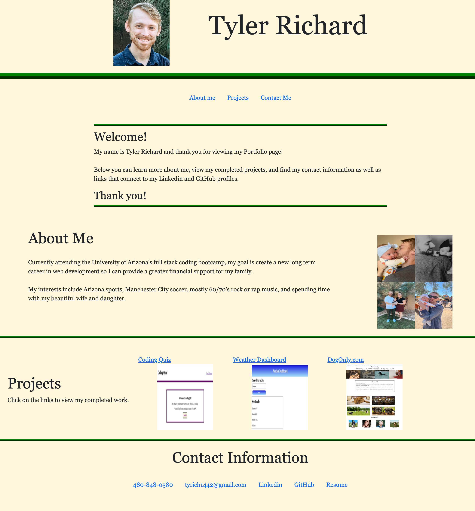

# Portfolio

---

### Table of Contents

- [Description](#description)
- [How To Use](#how-to-use)
- [References](#references)
- [Author Info](#author-info)

---

## Description

This is my updated Portfolio page that includes projects that I have completed during my time in the bootcamp. The portfolio also contains an about me section and contact information including links to my GitHub and Linkedin profiles. There is also a link to my resume which just brings up a separate HTML file, which you can then return to the main portfolio from if the user chooses to do so.

#### Technologies

- HTML
- CSS
- Bootstrap

---

## How To Use

- Please use the navigation bar to view different sections of the Portfolio. 
- Click on Project headers to view completed my completed work. 
- Use the links provided in the contact information to see my GitHub, Linkedin, and Resume, or send me an email.
- This website should be dynamic and change with the screen size. Please try it out by inpecting the page and adjusting the screen size.

---

## References

Deployed url: https://tr742.github.io/Portfolio/

---

## Author Info

- GitHub repository - https://github.com/TR742/Portfolio

[Back To The Top](#portfolio)